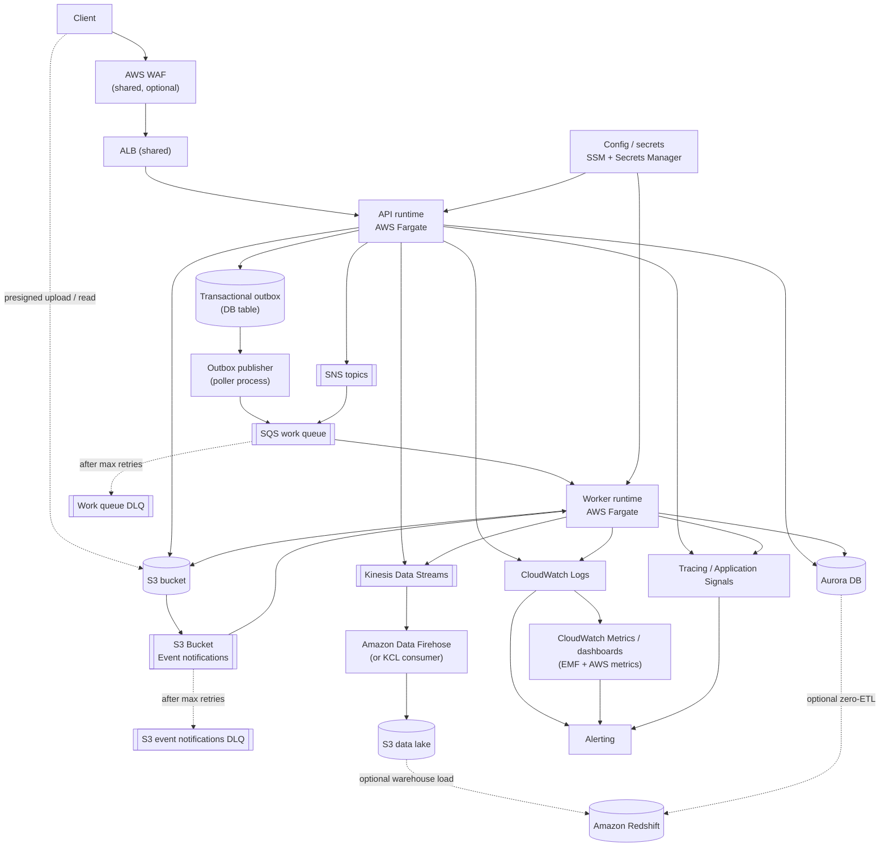

This is the runtime and dataflow pattern I would start with for most backend
services. Some branches are optional and should only be enabled when the
service actually needs them.

## Notes

- The `API -> outbox -> publisher -> SQS` path is the default reliable async
  publication model when queued work depends on committed database state.
- The point of the outbox is to avoid the classic split-brain failure where the
  database state change commits but the queue publish does not, or vice versa.
- The default pattern is: commit business state and outbox record in the same
  database transaction, then let a separate poller process drain the outbox
  with retries and alarms. The outbox is a database table, not a separate
  service — the publisher process is the piece that polls and enqueues.
- Direct client upload and download against object storage should use
  authenticated control-plane decisions plus short-lived signed URLs.
- DLQs are required for durable background processing and should have owners,
  alarms, and runbooks. Messages reach the DLQ only after exceeding the
  configured `maxReceiveCount` on the source queue — they do not flow there
  during normal operation.
- Kinesis Data Streams does not write directly to S3. An intermediate delivery
  layer is required: Amazon Data Firehose is the managed default for streaming
  to a data lake; a KCL application or Lambda consumer is the alternative when
  transformation or routing logic is needed.
- SNS delivers to SQS subscriptions wrapped in a JSON envelope unless raw
  message delivery is enabled on the subscription. Consumers of an
  SNS-subscribed queue need to handle the envelope or enable raw delivery.
- WAF and Shield are separate products. AWS Shield Standard is active on all
  AWS accounts at no charge and requires no configuration. WAF is a separately
  configured L7 firewall that is optional but becomes a practical default
  quickly for public APIs facing internet abuse.
- Kinesis, data lake, and Redshift are optional analytics branches, not part of
  the minimum runtime architecture.

## Why This Baseline

- Fargate is the default here because it gives long-lived APIs and workers a
  boring runtime model without the platform weight of EKS.
- Lambda is a good fit for smaller event-driven work when runtime limits, cold
  starts, and packaging constraints still fit the service.
- EKS should only be the default when the team is already committed to running
  Kubernetes for broader reasons than one backend service.
- WAF is optional, but it becomes a good default quickly for public APIs that
  face ordinary internet abuse or credential-stuffing noise.

## Related Guidance

- [Software]({{ '/software/' | relative_url }}): service boundaries, contracts, and
  background workflow design
- [Infra]({{ '/infra/' | relative_url }}): compute, queues, security, and
  delivery mechanics
- [Database]({{ '/database/' | relative_url }}): relational state, outbox posture,
  and migration rules
- [S3]({{ '/s3/' | relative_url }}): object lifecycle, access, and
  cost controls
