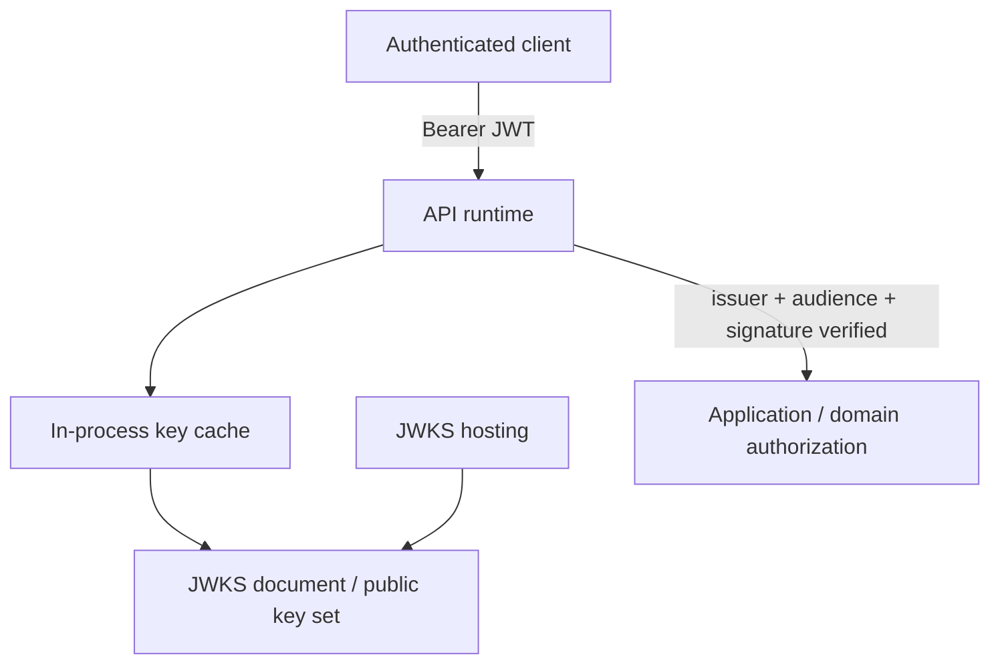

This is the authentication posture I would start with for API runtimes that
accept bearer JWTs signed by a trusted issuer.

## Notes

### Default stance

- Verify authentication before application authorization.
- Public-key JWT verification is the default for end-user or client bearer
  tokens.
- Application code still owns tenant, ownership, and action-level
  authorization after authentication succeeds.
- For service-to-service calls inside AWS, prefer IAM role-based identity for
  AWS resource access, and use an explicit application-layer auth mechanism for
  direct service-to-service HTTP unless the product model requires end-user
  delegation.

### JWT validation rules

- Require exact issuer and audience match against explicit configuration.
- Allow only explicitly configured signature algorithms. A good default is
  `RS256` or `ES256` when the issuer supports them.
- Never accept `alg=none`, and never let the token header choose the algorithm
  family by itself.
- Require `exp`, and validate `nbf` and `iat` when present with a small clock
  skew allowance. A good default leeway is `60` seconds, not many minutes.
- Access tokens should usually be short-lived. A good default is roughly `5` to
  `15` minutes unless the product has a concrete reason to differ.
- If a `kid` is present, select the verification key by `kid`. On an unknown
  `kid`, do one bounded JWKS refresh and then fail closed if no matching key
  exists.
- Normalize verified claims once and pass a trusted principal object into
  application code. Do not let business logic re-parse raw bearer tokens.

### JWKS cache and rotation posture

- Cache keys in memory by issuer and `kid`.
- Do not fetch the JWKS on every request. A good default cache TTL is `10`
  minutes with refresh on unknown `kid`.
- If the issuer is temporarily unreachable, serving a known cached key for a
  short bounded stale window is acceptable; accepting an unknown key is not.
- Publish old and new keys concurrently during rotation until all tokens signed
  by the old key have expired.
- Public verification keys are metadata, not secrets.
- If you self-host the JWKS, publish it through a stable low-cost static path
  such as S3 plus CloudFront.

### Gateway and application responsibilities

- An API gateway or edge proxy may perform coarse JWT verification and obvious
  deny decisions.
- Applications still own resource authorization, tenant checks, and any product
  rule that depends on business state.
- Do not trust identity headers from the public internet. If a gateway verifies
  tokens, applications should only trust forwarded identity over an
  authenticated internal hop they control.

### Revocation and session realities

- Signature verification proves token integrity and issuer trust, not that a
  user session is still active.
- If the product needs near-immediate revocation, forced logout, or device
  session control, pair short access-token TTLs with a stateful revocation or
  session lookup.
- Pure stateless JWT verification is a good default for many APIs, but it is
  not a full session-management system.

### When to deviate from this default

- Use opaque tokens plus introspection when central session control or
  immediate revocation matters more than edge-local verification.
- For browser and mobile OAuth clients, prefer Authorization Code plus PKCE
  rather than weaker front-channel token flows.
- Put step-up auth or MFA checks at the business-action boundary when some
  actions are materially higher risk than ordinary session-authenticated reads
  and writes.
- Use IAM roles for AWS resource access, or mTLS / service tokens for direct
  service-to-service authentication that does not represent an end user.
- Use private key-distribution paths only when network or regulatory posture
  requires them; public verification keys themselves do not need secrecy.

## Related Guidance

- [Software](./software/): application authz, contracts, and
  API design defaults
- [Infra](./infra/): service-to-service identity,
  secrets posture, and security defaults
