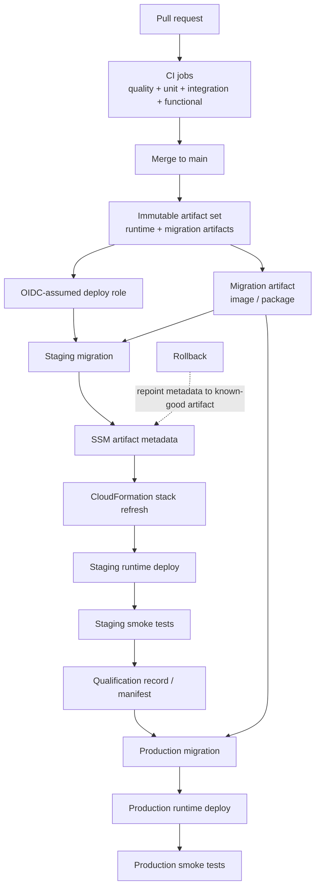

This is the build, qualification, deployment, and promotion flow I would start
with for one backend service.

## Release Invariants

- Build once, then promote the same artifact set through environments.
- A release artifact set should identify the exact runtime and migration
  artifacts by immutable digest or equivalent immutable reference.
- Treat database migrations as part of the release artifact set, not as an
  ad hoc operator step outside the delivery pipeline.
- Use OIDC or another short-lived federated mechanism for deploy access.
- A good default deploy mechanism is: update the artifact metadata parameter,
  then refresh the stack that consumes it.
- Production should receive the same artifact set that already qualified in
  staging.

## Mixed-Version Rollout Rules

- Normal deploys must tolerate a mixed-version window across API tasks, worker
  tasks, queue consumers, and producers.
- Treat database evolution like API evolution: if older runtimes may still be
  live during rollout or rollback, the schema has to stay backward-compatible
  enough for those older runtimes to keep working.
- Schema evolution should normally follow expand-contract: additive change
  first, rollout next, backfill after that, destructive cleanup only after the
  old runtime and old payload shape are gone.
- Runtime rollback should remain safe against the currently deployed schema and
  the messages still sitting in queues.
- If a release needs a schema or message-format break that makes normal rolling
  deploy or rollback unsafe, it needs an explicit phased runbook. It is not a
  standard deploy anymore.

## Migration Defaults

- When schema changes are involved, run additive migrations before worker and
  API rollout in each environment.
- Older runtimes should be able to keep operating against the post-migration
  schema during the mixed-version window. If they cannot, the migration is not
  ready for a normal zero-downtime rollout.
- A dedicated migration image or package is a good default because it gives the
  schema tool one immutable, auditable release unit alongside the runtime.
- In AWS ECS deployments, a good default is to run that migration artifact as a
  one-shot Fargate task with the same network reachability and database access
  posture the service runtime needs, rather than burying migrations inside
  application startup.
- Destructive schema changes should wait until the rollback window for the old
  runtime has closed.

## Promotion, Health Gates, And Progressive Rollout

- Staging qualification should include smoke tests and any release-critical
  checks for the service risk profile.
- Feature flags are useful for decoupling deploy from user-visible release, but
  they do not replace backward-compatible schemas, payloads, and rollback-safe
  runtime behavior.
- Production promotion should be blocked on migration success, smoke success,
  and no obvious health regressions such as error spikes, unhealthy targets, or
  runaway queue backlog.
- For higher-risk services, insert a progressive step before full production
  rollout, such as canary traffic, one-AZ rollout, or one-task verification,
  and gate expansion on live health signals.
- Record which exact artifact set qualified, when it qualified, and what checks
  passed.
- If the environment is regulated or otherwise higher-friction, explicit manual
  approval holds are fine, but they should sit on top of the same immutable
  artifact and qualification record rather than creating a second release path.

## Rollback And Hotfix Defaults

- Prefer runtime rollback to a previously qualified artifact before attempting
  ad hoc schema rollback.
- Schema rollback should be exceptional and runbook-driven, not the default
  incident response plan.
- Hotfixes should still produce an immutable artifact, run the critical
  verification needed for the incident, and record the promoted artifact set.
- If an incident forces a production-first hotfix, back-promote or re-qualify
  that same artifact in staging afterward so the next regular release starts
  from known-good state.

## When To Deviate

- Very low-blast-radius internal services may justify lighter qualification, but
  that should be an explicit decision, not silent drift.
- One-off data repairs, destructive migrations, or non-rolling cutovers need a
  service-specific runbook and operator ownership.

## Related Guidance

- [Infra](./infra/): deployment mechanics, OIDC,
  migration task defaults, and rollout sequencing
- [Database](./database/): schema rollout, migration posture,
  and restore expectations
- [Ops](./ops/): smoke tests, alarms, and incident
  ownership
