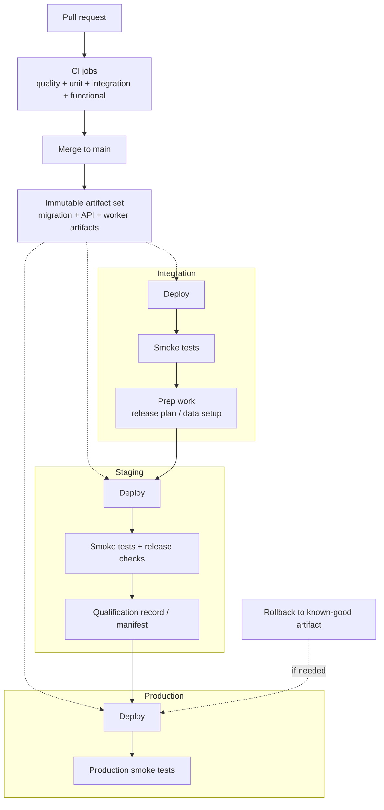
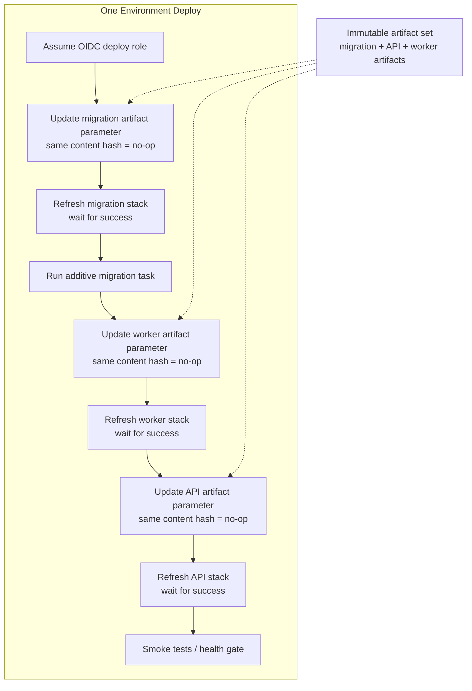

This is the build, qualification, deployment, and promotion flow I would start
with for one backend service.

## Release Invariants

- Build once, then promote the same artifact set through environments.
- A release artifact set should identify the exact runtime and migration
artifacts by immutable digest or equivalent immutable reference.
- Artifact tags should be content-hash based. If the code and config inputs did
not change, the artifact identity should not change either, and the
CloudFormation rollout should collapse to a no-op.
- Treat database migrations as part of the release artifact set, not as an
ad hoc operator step outside the delivery pipeline.
- Use OIDC or another short-lived federated mechanism for deploy access.
- Deploy by updating each stack's artifact parameter and refreshing that stack.
- Production should receive the same artifact set that already qualified in
staging.

## Deploy flow

Integration is where teams get things ready. Staging is the dress rehearsal.
Do not blur them.

## Mixed-Version Rollout Rules

- Normal deploys must tolerate a mixed-version window across API tasks, worker
tasks, queue consumers, and producers.
- Treat database evolution like API evolution: if older runtimes may still be
live during rollout or rollback, the schema has to stay backward-compatible
enough for those older runtimes to keep working.
- Schema evolution should normally follow expand-contract: additive change
first, rollout next, backfill after that, destructive cleanup only after the
old runtime and old payload shape are gone.
- Runtime rollback should remain safe against the currently deployed schema and
the messages still sitting in queues.
- If a release needs a schema or message-format break that makes normal rolling
deploy or rollback unsafe, it needs an explicit phased runbook. It is not a
standard deploy anymore.

## Promotion, Health Gates, And Progressive Rollout

- Integration is for exploratory deploys, dependency shakeout, and rehearsing
  unusual release steps. Staging is for qualification and needs to stay close
  enough to production to be a real rehearsal.
- Staging qualification should include smoke tests and any release-critical
checks for the service risk profile.
- Production promotion should be blocked on migration success, smoke success,
and no obvious health regressions such as error spikes, unhealthy targets, or
runaway queue backlog.
- For higher-risk services, insert a progressive step before full production
rollout, such as canary traffic, one-AZ rollout, or one-task verification,
and gate expansion on live health signals.
- Record which exact artifact set qualified and what checks passed.
- Manual approval holds are fine for higher-friction environments, but they
  should sit on top of the same artifact and qualification record rather than
  creating a second release path.

## Rollback And Hotfix Defaults

- Prefer runtime rollback to a previously qualified artifact before attempting
ad hoc schema rollback.
- Schema rollback should be exceptional and runbook-driven, not the default
incident response plan.
- Hotfixes should still produce an immutable artifact, run the critical
verification needed for the incident, and record the promoted artifact set.
- If an incident forces a production-first hotfix, back-promote or re-qualify
that same artifact in staging afterward so the next regular release starts
from known-good state.

## When To Deviate

- Very low-blast-radius internal services may justify lighter qualification, but
that should be an explicit decision, not silent drift.
- One-off data repairs, destructive migrations, or non-rolling cutovers need a
service-specific runbook and operator ownership.

## Related Guidance

- [Infra](./infra/): deployment mechanics, OIDC,
migration task defaults, and rollout sequencing
- [Database](./database/): schema rollout, migration posture,
and restore expectations
- [Ops](./ops/): smoke tests, alarms, and incident
ownership
