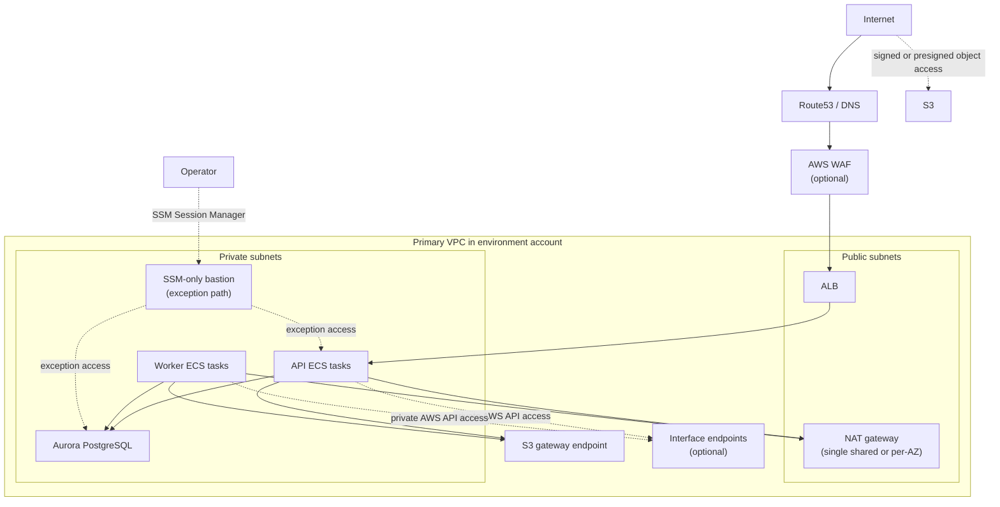

This is the network shape I would start with for most backend services in AWS.

## Notes

- Use one AWS account per environment, with the primary service VPC in that
  account.
- Choose a VPC CIDR with headroom. Running out of space later is miserable, and
  reworking CIDRs after other systems depend on them is exactly the sort of
  networking mistake teams remember for years.
- Plan the VPC CIDR and the per-AZ public and private subnet CIDRs explicitly
  up front.
- Reserve enough address space for future runtimes, endpoints, data services,
  and additional AZs even if day-one usage is small.
- Keep public subnets for the ALB and NAT gateways. Keep ECS services,
  databases, and bastions in private subnets.
- Do not give long-lived runtimes public IPs.
- Add an S3 gateway endpoint by default so S3 traffic from private subnets does
  not need to hairpin through NAT.
- Add interface endpoints when private-subnet AWS API traffic is common enough
  that the egress, availability, or isolation tradeoff justifies them.
- VPC flow logs are useful when you know why you need them. They are not free,
  and they are not automatically worth it in every environment.
- A single shared NAT is acceptable in a low-risk environment. Staging and
  production should usually use same-AZ NAT gateways.
- Bastion access should be exceptional and SSM-only. Do not open inbound SSH or
  RDP.
- Treat security groups as part of the network design, not an afterthought.
  Default to deny, then open only the specific ingress each runtime actually
  needs.
- Review security-group reachability through infrastructure changes, not ad hoc
  console edits that drift away from the intended network design.
- Keep routes, peerings, and security-group ingress narrow and explicit.

Once you outgrow a small number of per-environment VPC peerings, stop adding
more spaghetti. Transit Gateway is usually the right answer when multiple VPCs
need predictable routing and policy without turning every environment
connection into its own little networking project.

Before launch, there should be no ambiguity about the network skeleton:

- the environment account, VPC CIDR, and per-AZ subnet CIDRs are chosen
  intentionally before launch
- NAT posture is explicit, for example single shared NAT or same-AZ NAT
- interface endpoints are either deliberately in or deliberately out
- flow logs are enabled for a reason or left off on purpose
- long-lived runtimes have no public IPs
- security-group ingress is reviewed as part of the network design, with deny
  as the default posture, and infrastructure-as-code is the normal change path

## Example CIDR Plan

This is the kind of explicit subnet planning I would recommend. The exact
numbers can vary, but the important part is choosing them intentionally before
the environment accretes dependencies.

The subnet example below is for the `production` VPC (`10.8.0.0/16`). Apply
the same pattern to each environment using its own VPC base address.

| AZ | Public CIDR | Private-egress CIDR |
| --- | --- | --- |
| `us-east-1a` | `10.8.0.0/22` | `10.8.64.0/18` |
| `us-east-1b` | `10.8.4.0/22` | `10.8.128.0/18` |
| `us-east-1c` | `10.8.8.0/22` | `10.8.192.0/18` |

Example environment summary:

| Environment | VPC CIDR | AZs | NAT posture |
| --- | --- | --- | --- |
| `integration` | `10.0.0.0/16` | `us-east-1a`, `us-east-1b` | single shared NAT |
| `staging` | `10.4.0.0/16` | `us-east-1a`, `us-east-1b`, `us-east-1c` | same-AZ NAT |
| `production` | `10.8.0.0/16` | `us-east-1a`, `us-east-1b`, `us-east-1c` | same-AZ NAT |

## NAT Warning

NAT gateways are easy to add and easy to forget about. They are also an easy
way for a young environment to burn real money on baseline networking. The
practical rule is simple: avoid pushing unnecessary bytes through NAT because
it is expensive.

- treat NAT posture as an explicit cost decision, not a default checkbox
- use an S3 gateway endpoint by default; S3 gateway endpoints are free — there
  is no hourly charge, no data processing fee, and no data transfer fee; they
  only require a route table entry
- add interface endpoints when they keep enough AWS API traffic off NAT to be
  cheaper, or when the operational isolation is worth the extra cost; interface
- NAT can still be the right answer when third-party systems or customer
  firewalls need a fixed outbound source IP to allowlist
- a single shared NAT is often the right default for low-risk environments
- same-AZ NAT in staging or production is usually a deliberate availability
  tradeoff, not the cheapest option

If a team cannot explain why it is paying for its NAT layout, the design is not
finished yet.

## Related Guidance

- [Infra]({{ '/infra/' | relative_url }}): VPC, security, delivery, and
  service runtime defaults
- [Architecture]({{ '/architecture/' | relative_url }}): runtime and dataflow pattern
- [S3]({{ '/s3/' | relative_url }}): object access and signed delivery
